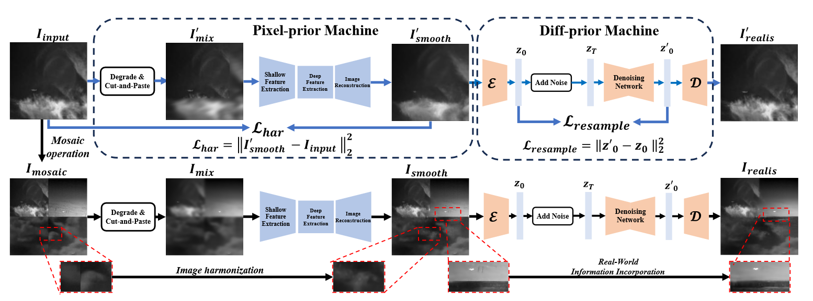
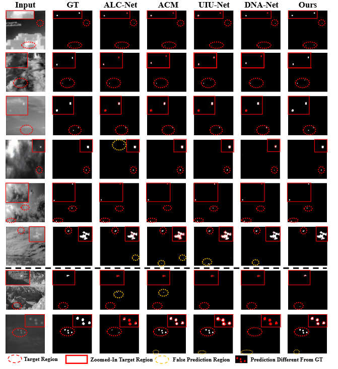

# Diff-Mosaic
**Diff-Mosaic ：Augmenting Realistic Representations in Infrared Small Target Detection via Diffusion Prior(TGRS 2024)**  [pdf](https://ieeexplore.ieee.org/document/10542973)
## Framework



## Experiment result



## 
## Inastall

```bash
conda create -n diffmosaic python=3.9
conda activate diffmosaic
pip install -r requirements.txt
```

## pre-trained model

1. Download Open clip model( [[huggingface]](https://huggingface.co/laion/CLIP-ViT-H-14-laion2B-s32B-b79K/resolve/main/open_clip_pytorch_model.bin)) and place it in `./weights/` 
2. Download Pixel-prior model ( [NUDT-SIRST](https://drive.google.com/file/d/1_qbtsj2GBZC53_8NgrN1tdc5Mx4Gz6wm/view?usp=drive_link) , [SIRST](https://drive.google.com/file/d/1Hg1Ejf1JoLcFcxwyXW5LNfHaXuxGvUch/view?usp=drive_link)) and place in `./weights/`
3. Download Diff-prior model ( [NUDT-SIRST](https://drive.google.com/file/d/1A0eAPv4gHYHU6uz4lUUylrbY-_df0UiS/view?usp=drive_link), [SIRST](https://drive.google.com/file/d/1QZ9c5kuaP_djg-O26HmBzhshlU6Y55q4/view?usp=drive_link) ) and place in `./weights/`

## Data Preparation
1. download the NUDT-SIRST dataset and SIRST dataset
2. run `mosaic.py` to generate Mosaic image
3. run `degrade.py` to get mix image

## Generate  augmentation sample

```bash
python inference.py --input ./add_noise/NUDT_mosaic/  --config configs/model/diff_prior.yaml --ckpt weights/NUDT_stage2/last.ckpt --swinir_ckpt weights/NUDT_stage1/last.ckpt --steps 50 --sr_scale 1 --repeat_times 1 --color_fix_type wavelet --output results/nudt_moc/ --device cuda --use_guidance --g_scale 400 --g_t_start 200
```

## Detection network
1. Download dataset( [[google]](https://drive.google.com/file/d/1LD_F78aZ86edZpkDBYAVjXSOIARf5RzP/view?usp=drive_link)) and place it in `./detection_model/dataset/`
2. Downolad pretrained model ( [[google]](https://drive.google.com/file/d/13RJnyuov2I0FsSvCPap1BlrIwfNmEFsN/view?usp=drive_link)) and place it in `./detection_model/pretrained_model/`
3. cd `./detection_model/`

## train
```bash
python train.py --base_size 256 --crop_size 256 --epochs 3000 --dataset enh_NUDT_aug --split_method 50_50 --model DNANet --backbone resnet_18  --deep_supervision True --train_batch_size 40 --test_batch_size 16 --mode TXT
```


## inference
```bash
python test.py --base_size 256 --crop_size 256   --model_dir ./pretrained_model/NUDT.tar --dataset NUDT_aug --split_method 50_50 --model DNANet --backbone resnet_18  --deep_supervision True --test_batch_size 1 --mode TXT
```

## Acknowledgement
This project is build based on [DNANet](https://github.com/YeRen123455/Infrared-Small-Target-Detection) and [DiffBIR](https://github.com/XPixelGroup/DiffBIR). We thank the authors for sharing their code.
